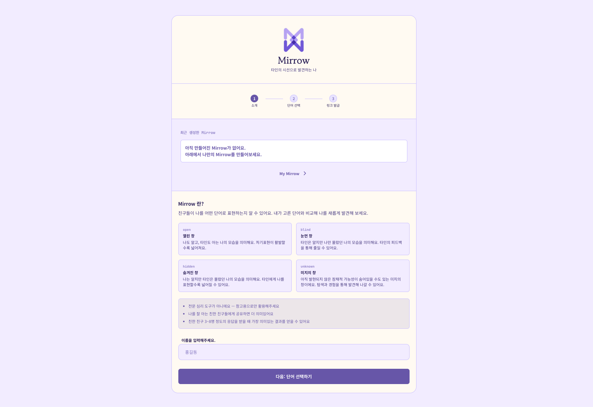
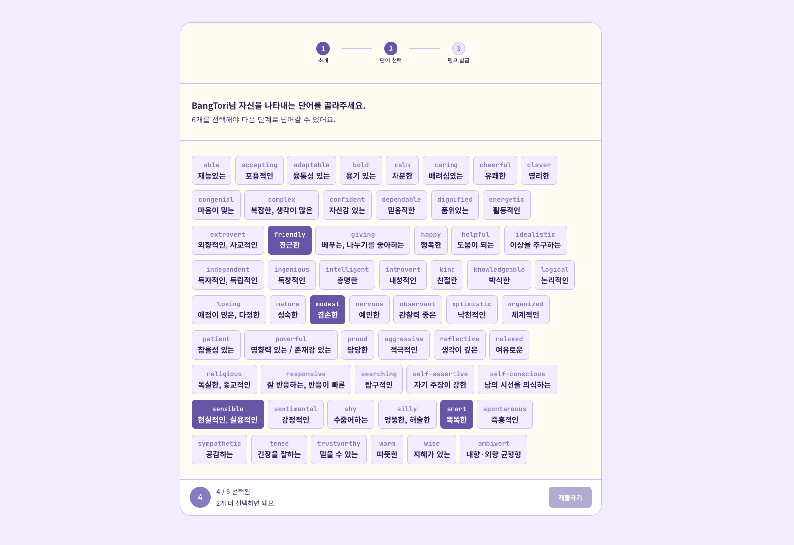
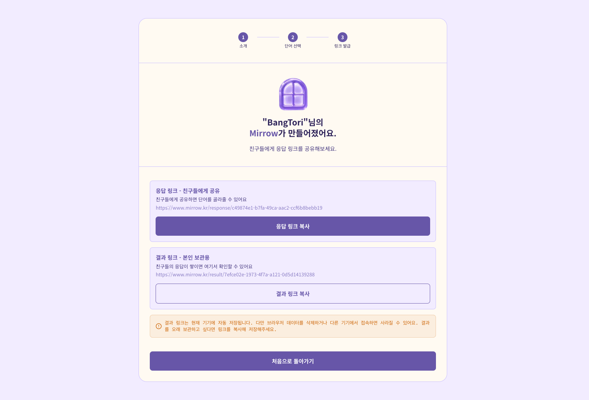
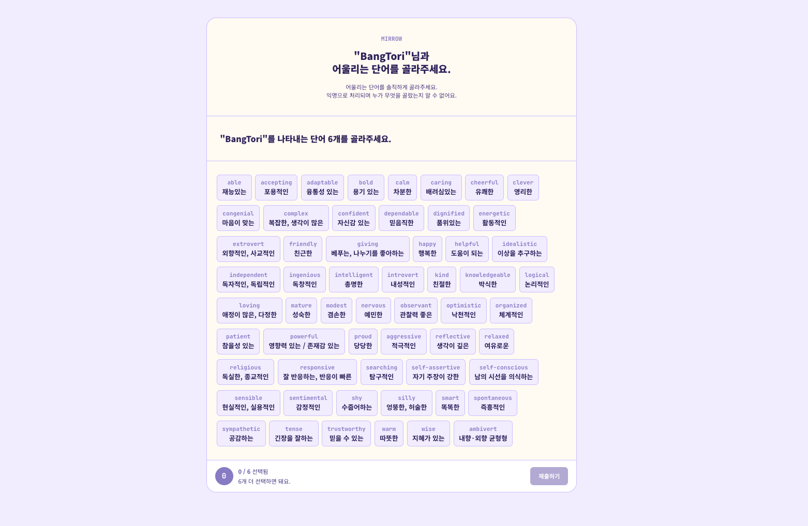
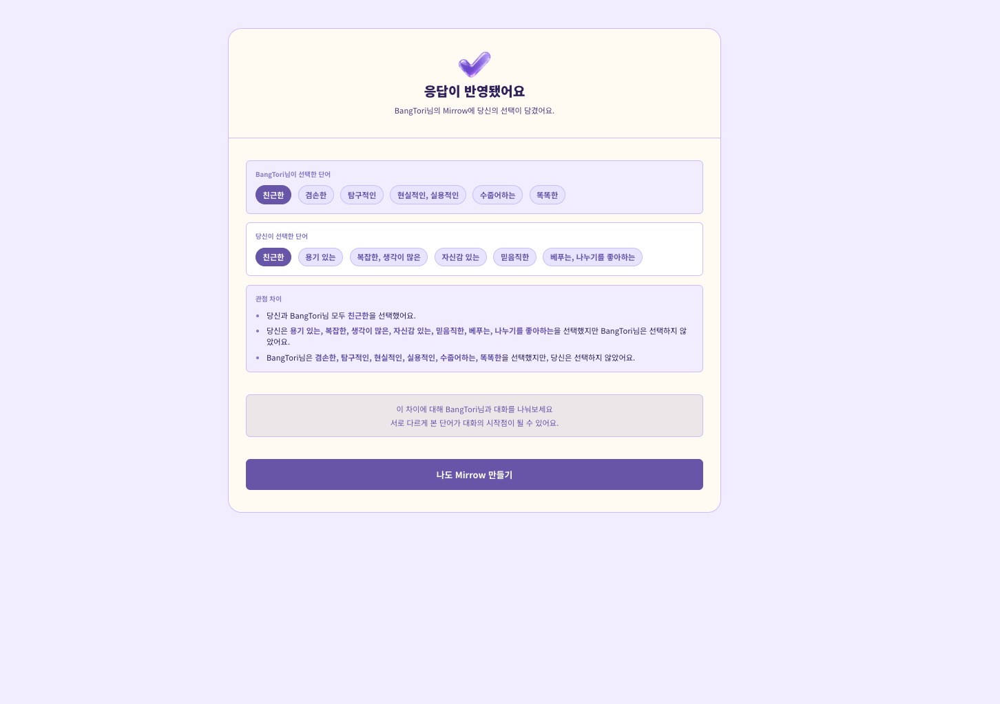
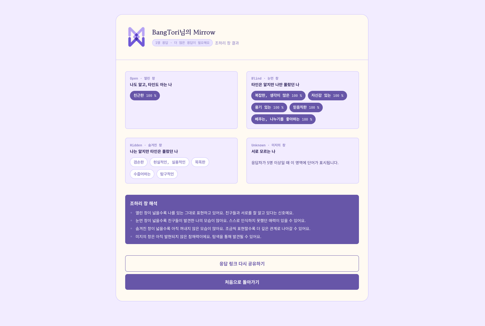

# Mirrow

> 내가 생각하는 나와 타인이 생각하는 나의 차이를 발견하는 조하리 창 기반 자기 인식 서비스

## 배포 링크

- https://mirrow.kr

---

# 1. 프로젝트 개요

Mirrow는 조하리 창(Johari Window) 이론을 기반으로 자기 인식과 타인 인식의 차이를 탐색할 수 있는 웹 서비스입니다.

사용자는 자신을 가장 잘 나타낸다고 생각하는 단어 6개를 선택하고, 친구들에게 링크를 공유해 응답을 받습니다.

수집된 응답은 조하리 창의 4개 영역으로 분류되어 시각화되며, 사용자는 자신이 인식하는 모습과 타인이 인식하는 모습의 차이를 확인할 수 있습니다.

## 1-1. 기획 배경

"친구들은 나를 어떻게 보고 있을까?"
조하리 창(Johari Window) 개념을 접한 뒤, 이를 실제로 경험해볼 수 있는 서비스를 만들어보고 싶었습니다.
Mirrow는 사용자를 평가하거나 진단하는 서비스가 아닙니다.
같은 단어를 선택했는지보다 왜 서로 다르게 보았는지를 발견하고, 대화의 시작점을 만들어주는 경험에 집중했습니다.

---

# 2. 주요 기능

- Mirrow 생성 : 사용자가 자신을 나타내는 단어 6개를 선택하여 Mirrow를 생성합니다.
- 응답 링크 공유 : 생성된 링크를 친구들에게 공유하여 응답을 받을 수 있습니다.
- 익명 응답 : 응답자는 익명으로 단어를 선택할 수 있습니다.
- 조하리 창 결과 분석 : 수집된 응답을 조하리 창 4영역으로 시각화합니다.
- Visitor 비교 결과 : 응답자는 자신의 선택과 출제자의 선택 차이를 비교할 수 있습니다.
- 마이페이지 : 생성한 Mirrow를 로컬에 저장하고 다시 확인할 수 있습니다.

---

# 3. 실행 화면

<details open>
<summary><strong>1. Mirrow 생성</strong></summary>

<table>
  <tr>
    <td width="33%" valign="top">
      <strong>1-1.소개 페이지</strong>
      <p>사용자가 이름을 입력하고 Mirrow를 생성하는 시작 화면입니다.</p>
      
    </td>
    <td width="33%" valign="top">
      <strong>1-2. 본인 단어 선택</strong>
      <p>57개의 단어 중 자신을 가장 잘 표현한다고 생각하는 단어 6개를 선택합니다.</p>
      
    </td>
    <td width="33%" valign="top">
      <strong>1-3. 링크 발급</strong>
      <p>응답 링크와 결과 링크를 생성하고 친구들에게 공유할 수 있습니다.</p>
      
    </td>
  </tr>
</table>

</details>

<details open>
<summary><strong>2. 친구 응답</strong></summary>

<table>
  <tr>
    <td width="50%" valign="top">
      <strong>2-1. 응답 페이지</strong>
      <p>공유받은 사용자가 출제자를 표현하는 단어 6개를 선택합니다.</p>
      
    </td>
    <td width="50%" valign="top">
      <strong>2-2. Visitor 결과</strong>
      <p>응답자는 자신의 선택과 출제자의 선택 차이를 비교할 수 있습니다.</p>
      
    </td>
  </tr>
</table>

</details>

<details open>
<summary><strong>3. 결과 확인</strong></summary>

<table>
  <tr>
    <td width="50%" valign="top">
      <strong>3-1. 조하리 창 결과</strong>
      <p>수집된 응답을 조하리 창 4개 영역으로 분류하여 시각화합니다.</p>
      
    </td>
  </tr>
</table>

</details>

---

# 4. 기술 스택

| 분야       | 기술                          |
| ---------- | ----------------------------- |
| Frontend   | Next.js 16, React, TypeScript |
| Styling    | Tailwind CSS v4               |
| Backend    | Supabase                      |
| Database   | PostgreSQL                    |
| Deployment | Vercel                        |
| Analytics  | Custom Event Logging          |

<details>
<summary><strong>기술 선택 이유</strong></summary>

### Next.js App Router

- 대부분 페이지가 데이터 기반으로 동작하며 SEO 대응도 필요했습니다. Server Component와 Server Action을 활용하여 데이터 로딩과 비즈니스 로직을 서버 중심으로 구성했습니다.

### Supabase

- 빠른 MVP 검증이 목표였기에 Auth, Database, RLS, Hosting을 별도 구축하지 않고도 빠르게 서비스 운영 환경을 구성할 수 있어 선택했습니다.

### Custom Event Logging

- MVP 단계에서 필요한 사용자 행동 데이터만 빠르게 수집하기 위해 별도 분석 도구 대신 Supabase 이벤트 테이블과 SQL 기반 분석을 선택했습니다.

</details>

---

# 5. 서비스 플로우

```text
Mirrow 생성
↓
응답 링크 공유
↓
응답 수집
↓
조하리 창 결과 생성
↓
결과 확인
↓
Visitor 비교 결과 확인
```

---

<details>
<summary><strong>주요 설계 결정</strong></summary>

## 로그인 없이 바로 참여할 수 있는 경험 설계

### 목표

- 누구나 링크만 받으면 바로 참여 가능
- 서비스 이용 전 회원가입 요구 제거
- 응답 참여 과정의 이탈 최소화

### 고민

- 사용자가 생성한 Mirrow와 결과를 안정적으로 보관하려면 계정 시스템과 데이터 저장 기능을 도입하는 방법도 있었습니다.
- 하지만 조하리 창 서비스의 특성상 대부분의 사용자는 친구에게 링크를 받고 한 번 참여하는 사용자일 가능성이 높다고 판단했습니다.
- 이 과정에서 회원가입이나 로그인을 요구하면 참여율이 크게 낮아질 수 있다고 생각했습니다.

### 결정

- Supabase Auth를 도입하지 않고 localStorage 기반으로 사용자의 생성 이력과 응답 이력을 관리했습니다.

### 이유

- 초기 단계에서는 데이터 영속성보다 참여 장벽을 낮추는 것이 더 중요하다고 판단했습니다.
- 사용자는 로그인 없이 바로 Mirrow를 생성하거나 응답할 수 있으며, 서비스에 대한 거부감 없이 빠르게 경험할 수 있습니다.
- 대신 데이터는 브라우저 단위로 관리되므로 기기 변경이나 저장소 삭제 시 기록이 사라질 수 있다는 트레이드오프를 수용했습니다.

---

## 결과 링크와 응답 링크 분리

### 응답 링크

```text
/response/[id]
```

### 결과 링크

```text
/result/[result_token]
```

### 이유

- 응답 참여와 결과 조회의 책임을 분리하기 위함입니다.
- 출제자만 결과를 보관하고 자세히 조회할 수 있도록 설계했습니다.

</details>

---

<details>
<summary><strong>MVP에서 의도적으로 제외한 것</strong></summary>

## 사용자 계정 시스템

추후 확장 가능하지만 초기 검증 단계에서는 제외했습니다.

---

## 결과 영구 저장

현재는 localStorage 기반으로 관리합니다.

빠른 사용 경험 검증을 우선했습니다.

---

## 링크 비활성화 기능

DB에는 is_active 컬럼을 두었지만 운영 기능은 아직 제공하지 않습니다.

실제 사용 데이터를 확보한 후 필요성을 검증할 예정입니다.

</details>

---

# 6. 운영 및 사용자 피드백

출시 후 실제 사용자들에게 서비스를 공유하고 이벤트 로그를 수집하고 있습니다.

수집 이벤트

```text
PROFILE_CREATED
RESPONSE_COMPLETED
RESULT_VIEWED
RESPONSE_LINK_COPIED
RESPONSE_LINK_RESHARED
VISITOR_CREATE_CLICKED
```

## 초기 사용자 피드백

- 이미 응답한 페이지에서 이동 경로 부족
- 설명 텍스트 가독성 부족
- 이름 길이 제한 필요
- 단어 표현 일부 어색함

## 반영 사항

**<hotfix v1>**

- 홈 이동 버튼 추가
- 설명 텍스트 토큰 분리
- 이름 최대 10자 제한 추가

---

# 7. 프로젝트를 통해 얻은 것

Mirrow를 개발하며 기능 구현보다 서비스 운영이 더 큰 과제라는 점을 경험했습니다.

실제 사용자를 대상으로 서비스를 배포하고,

- 사용자 행동 데이터 분석
- 이벤트 로그 설계
- 피드백 수집 및 반영
- UX 개선 의사결정

과정을 반복하며 제품 관점에서 문제를 바라보는 경험을 얻을 수 있었습니다.
